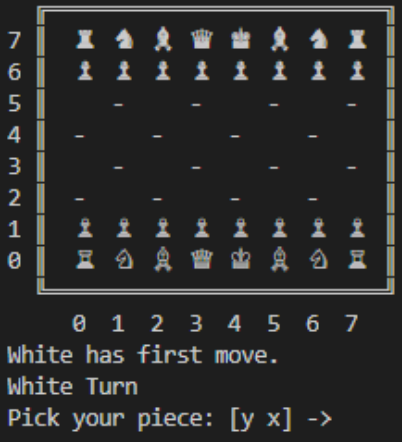
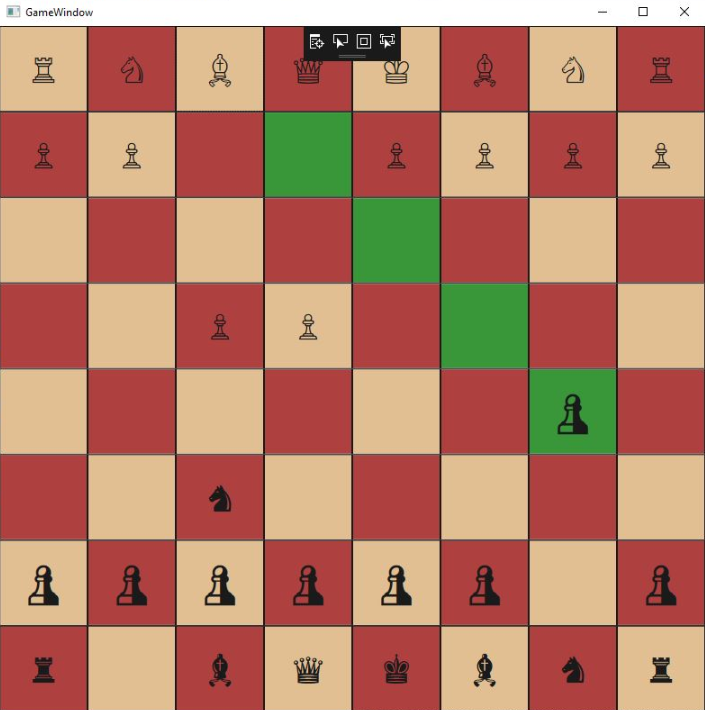

# Chess AI

A chess engine with an intelligent AI player. 

## Implementation
### Algorithms
The intelligent chess player predicts future moves and chooses the best available move. The predictions are calculated using a minimax algorithm and alpha-beta pruning. 
### Console Application
A quick prototype that displays the game on the Console. Written in Python for quick deployment in exchange for runtime speed. Moves are entered through the command line as a tuple. 

     
    <em>Figure 1: Starting Board on Console</em>

### GUI Application
A faster version written in C#. A destop app created using a WPF is used to display the chess board. Moves are entered by clicking the desired piece and position to move to. 

Additional features not present in the console application include:
- Highlighting where AI moved
- Clicking pieces to see available moves (shown below)

     
    <em>Figure 2: In-Game on GUI</em>

